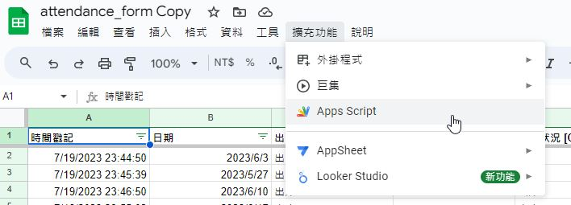
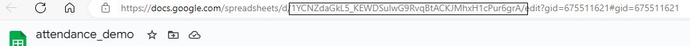
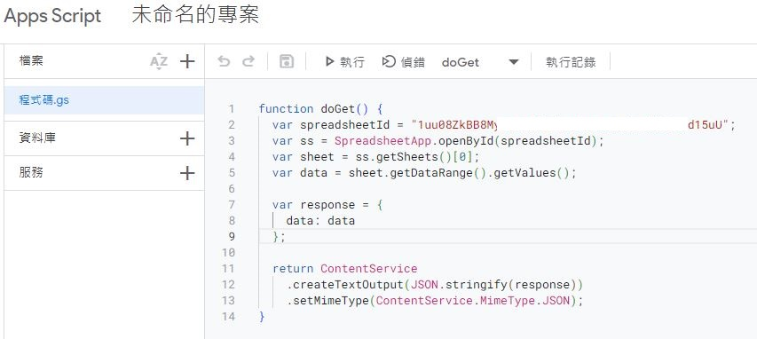
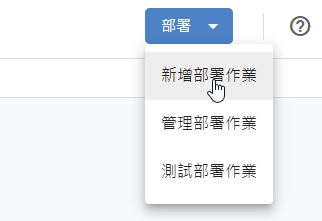
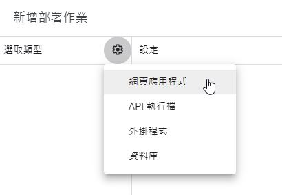
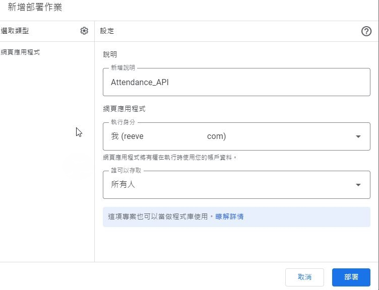

# Streamlit app for attendance visualization

## Google App Script Setup


1. Lanuch Google Apps Script<br>


2. Find the doc ID on the link of the goolg spreadsheet. <br> 
Replace YOUR_DOC_ID and paste below code to the GS file and .


```bash
function doGet() {
    var spreadsheetId = "YOUR_DOC_ID";
    var ss = SpreadsheetApp.openById(spreadsheetId);
    var sheet = ss.getSheets()[0];
    var data = sheet.getDataRange().getValues();

      var response = {
        data: data
    };

    return ContentService
        .createTextOutput(JSON.stringify(response))
        .setMimeType(ContentService.MimeType.JSON);
}
```


3. Click below <br>


4. Select type <br>


5. Select type <br>


6. Grant permissions <br>


7. Copy the webpage link <br>
